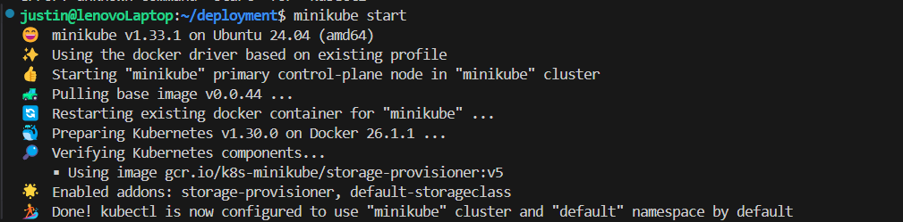
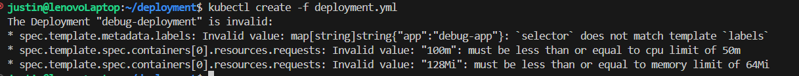
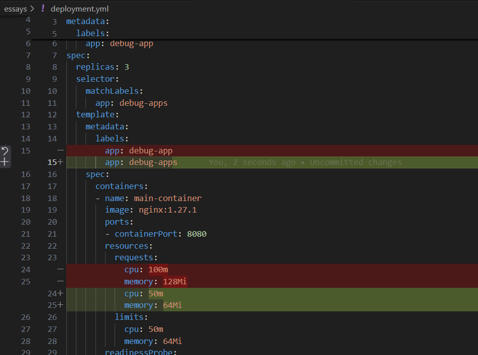
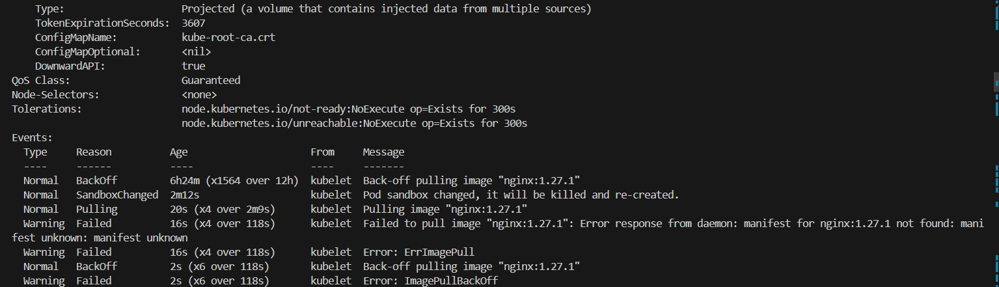
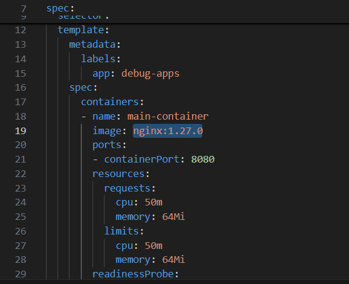
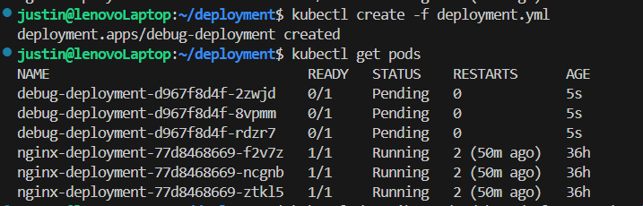
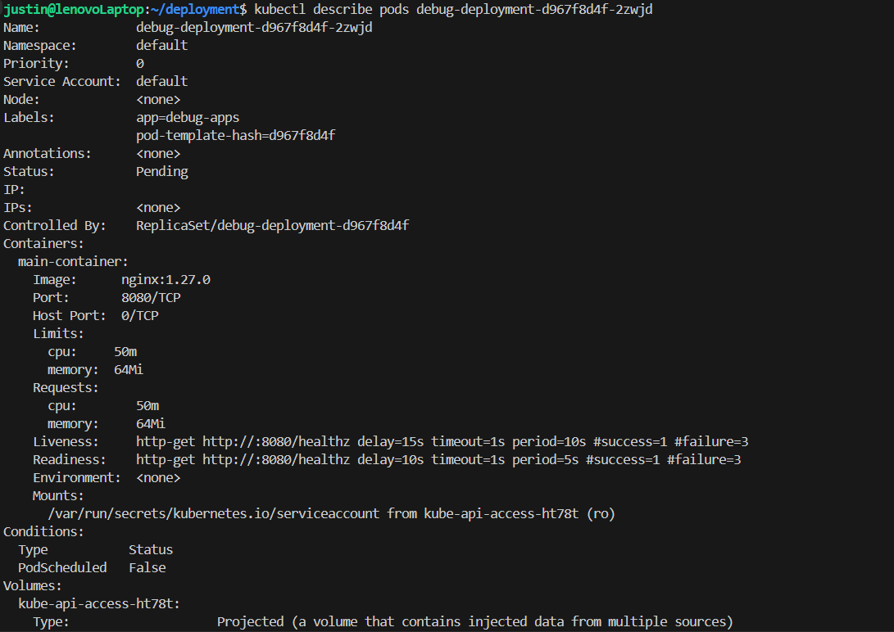
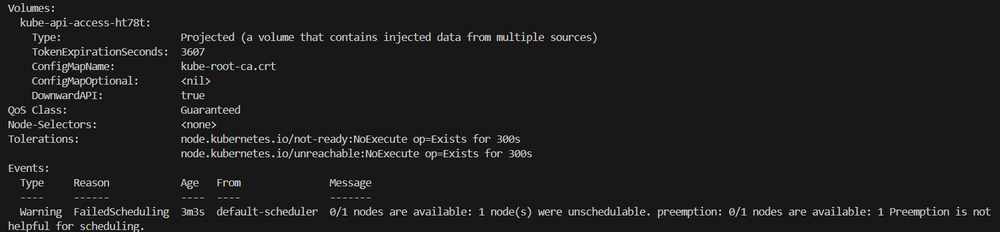
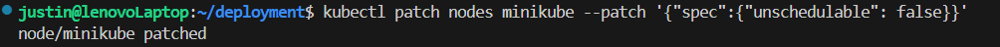
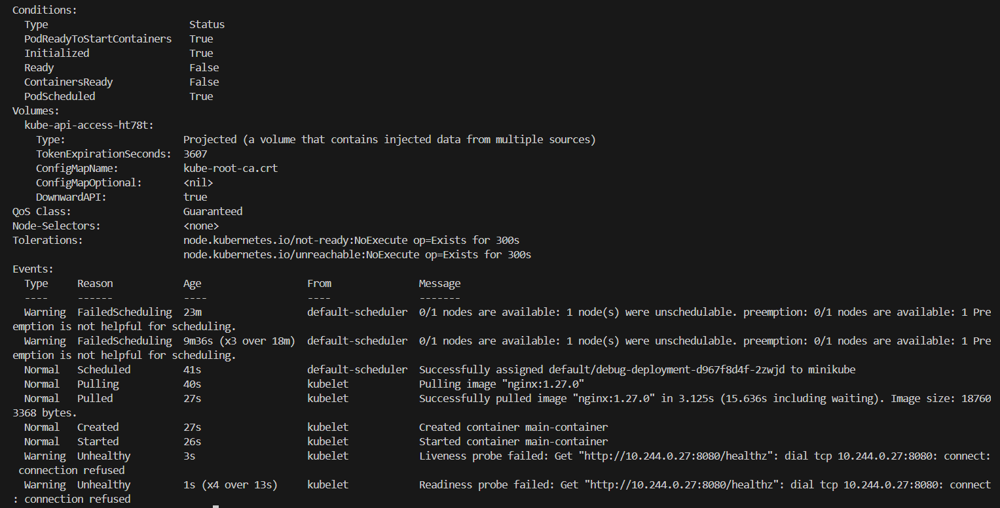

# Deployment Debug Essay

`minikube start`

`kubectl create -f deployment.yml`

`kubectl describe pods debug-deployment-6b9876754d-jnz5j`

`kubectl create -f deployment.yml`

`kubectl get pods`

`kubectl describe pods debug-deployment-d967f8d4f-2zwjd`

`kubectl patch nodes minikube --patch '{"spec":{"unschedulable": false}}'`

`kubectl describe pods debug-deployment-d967f8d4f-2zwjd`
